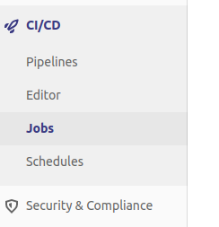
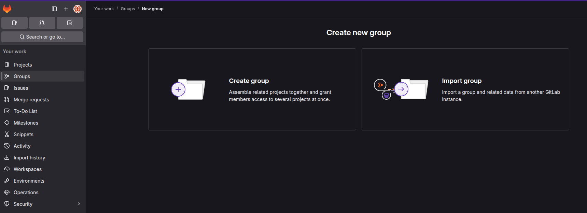
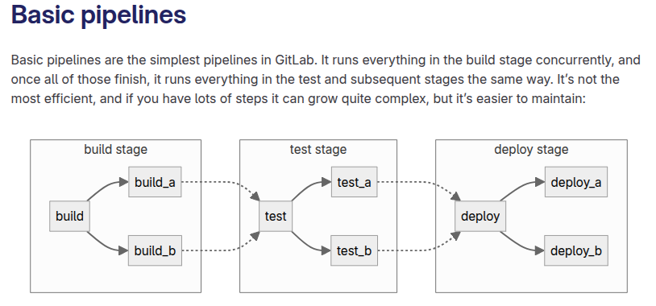
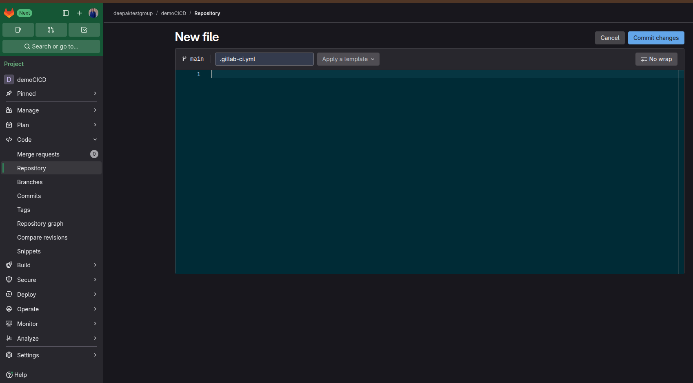
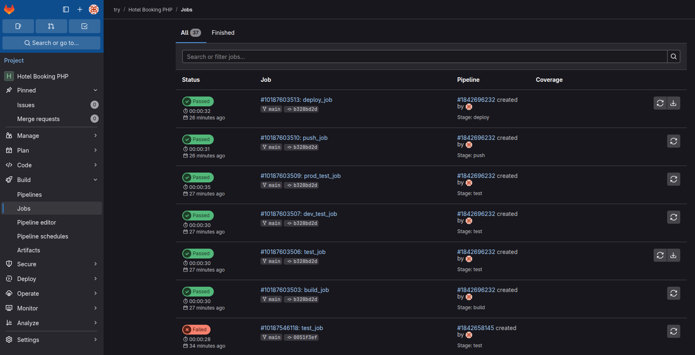
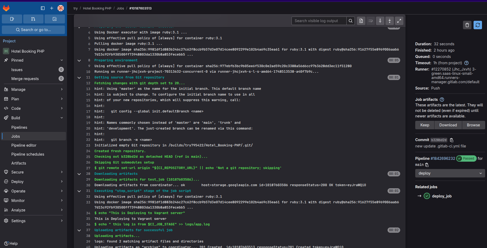
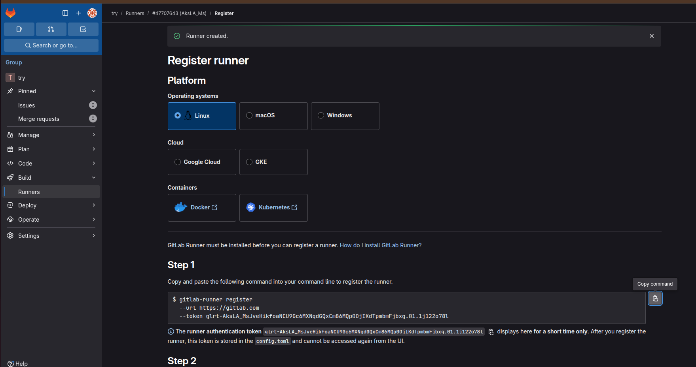
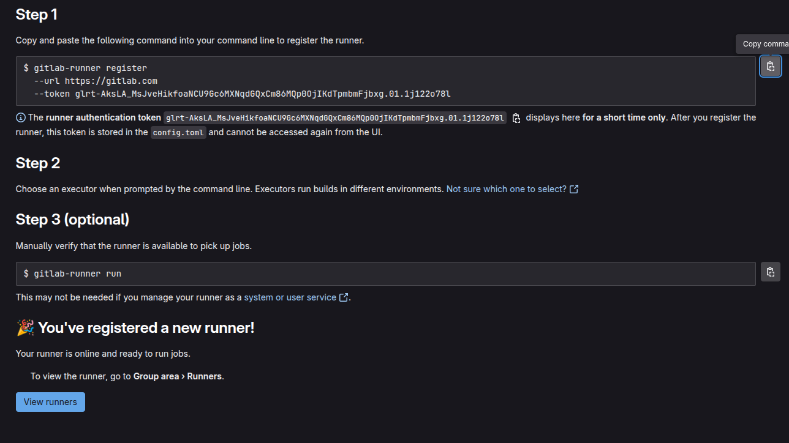
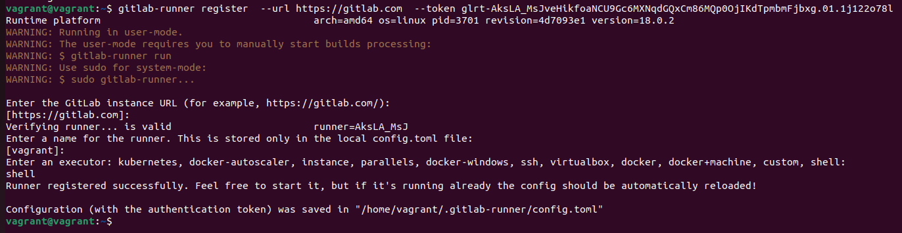

Reference link:
https://docs.gitlab.com/tutorials/

# **What is GitLab? (Simple Explanation)**

GitLab is a tool that helps developers store, manage, and collaborate on code. Think of it like **Google Drive for code**, but with extra features for software development.

# **Key Features of GitLab**

1. **Version Control** – Tracks changes in code, so you can go back to previous versions if needed.
2. **Collaboration** – Multiple developers can work on the same project without conflicts.
3. **CI/CD** – Automates testing and deployment, so updates can be released faster.
4. **Issue Tracking** – Helps teams organize and fix bugs efficiently.
5. **Security & DevOps Tools** – Ensures code is secure and well-managed.

# **Example Scenario**

- You write code for a website and **push** it to GitLab.
- Your teammate makes improvements and **merges** their changes.
- GitLab automatically **tests** the code to make sure nothing is broken.
- Once everything is good, GitLab **deploys** the new version to the website.


*These are tools and features provided by platforms like GitLab, GitHub, or other CI/CD systems to automate the process of building, testing, and deploying software.*


 1. CI/CD
What it is: CI/CD stands for Continuous Integration and Continuous Deployment. It’s a process that automates the steps required to take code from development to production.

Example: Imagine you’re building a website. Every time you make a change to the code, CI/CD automatically tests the changes and deploys the updated website to the server without manual intervention.

2. Pipelines
What it is: A pipeline is a series of automated steps (jobs) that run to build, test, and deploy your code. Each step in the pipeline performs a specific task.

Example: For a website, a pipeline might:

Build: Compile the code.

Test: Run automated tests to check for bugs.

Deploy: Push the updated code to the live server.

3. Editor
What it is: A tool or interface that allows you to write and edit your CI/CD configuration files (e.g., .gitlab-ci.yml or .github/workflows.yml).

Example: If you want to define a pipeline, you use the editor to write the configuration file that tells the CI/CD system what to do.

4. Jobs
What it is: Jobs are individual tasks within a pipeline. Each job performs a specific action, like running tests or deploying code.

Example: In a pipeline, you might have:

A build job to compile the code.

A test job to run unit tests.

A deploy job to push the code to production.

5. Schedules
What it is: Schedules allow you to run pipelines automatically at specific times or intervals (e.g., daily, weekly).

Example: You can schedule a pipeline to run every night at 2 AM to test your code and generate a report.

6. Security & Compliance
What it is: Tools and features that help you ensure your code and deployments are secure and follow compliance standards.

Example: A security scan in the pipeline might check for vulnerabilities in your code, or a compliance check might ensure that your deployment follows company policies.

How It All Works Together: Example
Let’s say you’re building a mobile app. Here’s how these components work together:

CI/CD: Automates the entire process of building, testing, and deploying your app.

Pipeline: Defines the steps:

Job 1: Build the app.

Job 2: Run automated tests.

Job 3: Deploy the app to the app store.

Editor: You use the editor to write the configuration file that defines the pipeline.

Jobs: Each job performs a specific task (e.g., building, testing, deploying).

Schedules: You set up a pipeline to run every night to ensure the app is always up-to-date.

Security & Compliance: The pipeline includes a security scan to check for vulnerabilities in the app.

Summary in Simple Terms:
CI/CD: Automates the process of building, testing, and deploying software.

Pipelines: A series of steps (jobs) that run automatically.

Editor: A tool to write the configuration for the pipeline.

Jobs: Individual tasks in the pipeline (e.g., build, test, deploy).

Schedules: Automatically run pipelines at specific times.

Security & Compliance: Ensures your code is secure and follows rules.

*Note: only users with the Maintainer or Owner role can import projects into groups or namespaces*


*Note: Create Group and then create ya import the project into the group .Add user into group and 



Configure SSH in Gitlab server public key in gitlab .
```shell
cd .ssh
cat cat id_rsa.pub
```

Clone your project using SSH.
```shell
git clone git@gitlab.com:deepaktest1/democicd.git
```

### Creating CI/CD pipeline

*Pipelines  ------>  stages  ------>  jobs*



Example basic `/.gitlab-ci.yml` pipeline configuration matching the diagram:
```shell
stages:
  - build
  - test
  - deploy

default:
  image: alpine

build_a:
  stage: build
  script:
    - echo "This job builds something."

build_b:
  stage: build
  script:
    - echo "This job builds something else."

test_a:
  stage: test
  script:
    - echo "This job tests something. It will only run when all jobs in the"
    - echo "build stage are complete."

test_b:
  stage: test
  script:
    - echo "This job tests something else. It will only run when all jobs in the"
    - echo "build stage are complete too. It will start at about the same time as test_a."

deploy_a:
  stage: deploy
  script:
    - echo "This job deploys something. It will only run when all jobs in the"
    - echo "test stage complete."
  environment: production

deploy_b:
  stage: deploy
  script:
    - echo "This job deploys something else. It will only run when all jobs in the"
    - echo "test stage complete. It will start at about the same time as deploy_a."
  environment: production
```

Creating CI





Predefined variables:
https://docs.gitlab.com/ci/variables/predefined_variables/

**Artifacts** are files or directories created during a CI/CD job that you want to **save and share** with other jobs or download after the pipeline runs.

```shell
test_job:
    stage: test
    script:
        - echo "This is testing of out docker build done by CI_COMMIT_AUTHOR"
        - mkdir -p logs
        - echo "Test results" > logs/app.log
    artifacts:
        paths:
            - logs/
        expire_in: 1 week
push_job:
    stage: push
    script:
        - echo "This is pushing"
        - echo "to docker hub for $DEPLOY_ENV"
    
deploy_job:
    stage: deploy
    script:
        - echo "This is Deploying to Vagrant server"
        - echo " this log is from $CI_JOB_STAGE" >> logs/app.log
    artifacts:
        paths:
            - logs
        expire_in: 1 week
```
#### **Key Points**

1. **What Are Artifacts?**
    
    - Files generated during a job (e.g., logs, test reports, binaries).
        
    - Saved by GitLab and available for:
        
        - Download from the UI.
            
        - Use in later pipeline jobs.
            
2. **Why Use Artifacts?**
    
    - Pass data between jobs (e.g., test results → deploy job).
        
    - Debug failures by downloading logs.
        
    - Store build outputs (e.g., compiled apps).


* If you wants to download artifacts log file so .

### Runners

*Make sure to install the GitLab runner tools on your instance before creating the runner.

A single GitLab Runner can be used by multiple projects?there is no strict limit to how many projects can use the same runner. You can register one runner and assign it as a shared runner (available to all projects in your GitLab instance) or as a specific runner (assigned to one or more specific projects or groups)

#### Security for self-managed runners

If you plan to run your GitLab CI/CD jobs on self-managed runners, then security risks exist for your compute infrastructure and network.


```shell
curl -L "https://packages.gitlab.com/install/repositories/runner/gitlab-runner/script.deb.sh" | sudo bash
sudo apt install gitlab-runner
```




Create our runner so check right side `Create project runner`






Runner after that 



- Start/Restart Your Runner using terminal
```shell
sudo systemctl status gitlab-runner
sudo systemctl start gitlab-runner
```
* Running manually 
```shell
gitlab-runner run
```
* If the runner is online but jobs are still pending, check the runner logs for errors:
```shell
sudo journalctl -u gitlab-runner
```

* Check how many runner in your server
``` shell
gitlab-runner list
```


Reference:
1. https://www.youtube.com/watch?v=lFfqBxZf-6c
2. https://docs.gitlab.com/runner/install/linux-repository/
3. https://www.cloudthat.com/resources/blog/overview-of-gitlab-runner-and-guide-to-perform-ci-cd-on-gitlab
4. https://docs.gitlab.com/ci/pipelines/pipeline_architectures/
5. https://cheatography.com/violaken/cheat-sheets/gitlab-ci-cd-pipeline-configuration/pdf/?last=1572483501
6. 